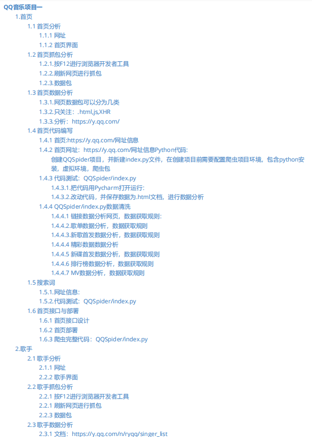
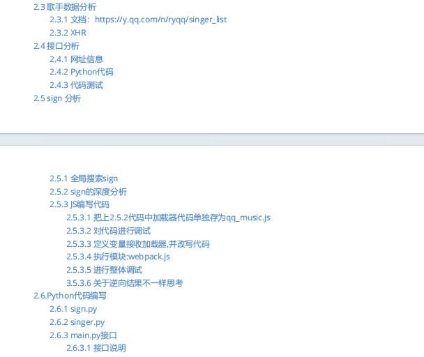
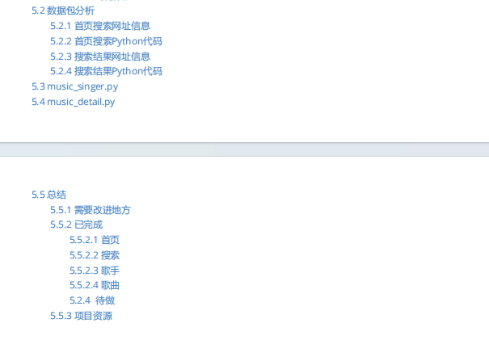

# QQMusicSpiders
史上最详细的QQ Music  Spider，没有之一，不容反驳。本项目主要QQ Music爬虫项目，涉及：首页信息，歌手信息，歌曲信息
## 一、项目目录

## 二、部分文档
### 5.5 总结

到此总个项目就此完结，下面将进行总结。

#### 5.5.1 需要改进地方

1.首页数据图片是Base64格式，暂时未解决

2.部分程序涉及登录，后期想做一个QQ音乐自动登录的项目来获取有效Cookie，实现项目的完整

3.歌手详细信息处理

4.大部分信息是原始数据，并未针对信处理

5.接口未写完全细化

6.项目部署

#### 5.5.2 已完成

##### 5.5.2.1 首页

- [x] 首页链接:顶部链接，导航栏链接，其它链接
- [x] 歌单推荐
- [x] 新歌首发
- [x] 精彩数据
- [x] 新碟首发
- [x] 排行榜
- [x] MV

##### 5.5.2.2 搜索

- [x] 任意搜索歌手
- [x] 任意搜索歌曲

##### 5.5.2.3 歌手

- [x] 可分页歌手列表

- [x] 歌手详细信息

##### 5.5.2.4 歌曲

- [x] 歌曲详细信息
- [x] 歌曲评论
- [x] 歌曲文件：音乐文件，歌词

##### 5.2.4  待做

- [ ] 重新整理业务逻辑

- [ ] 对爬虫代码进行整合，定义为qq_music.py,此文件包含所有的爬虫
- [ ] 对业务逻辑进行处理，如搜索任何歌曲时，返回歌曲的详细信息：歌曲名，歌手，音乐文件，歌词
- [ ] 对业务逻辑信息进行处理，返回歌手详细信息，以及歌手的歌曲
- [ ] 对业务逻辑信息进行处理，按照最新想法编写接口
- [ ] 编写接口文档
- [ ] 编写接口测试用例

- [ ] docker部署

#### 5.5.3 项目资源

1.项目资源

2.爬虫项目抓取文档

* QQ音乐项目一
* QQ音乐项目二

## 三、使用
安装相应的库，并添加Cookie就可以使用。

## 四、免责声明
本项目只用研究，欢迎交流，禁止用于商业用途。